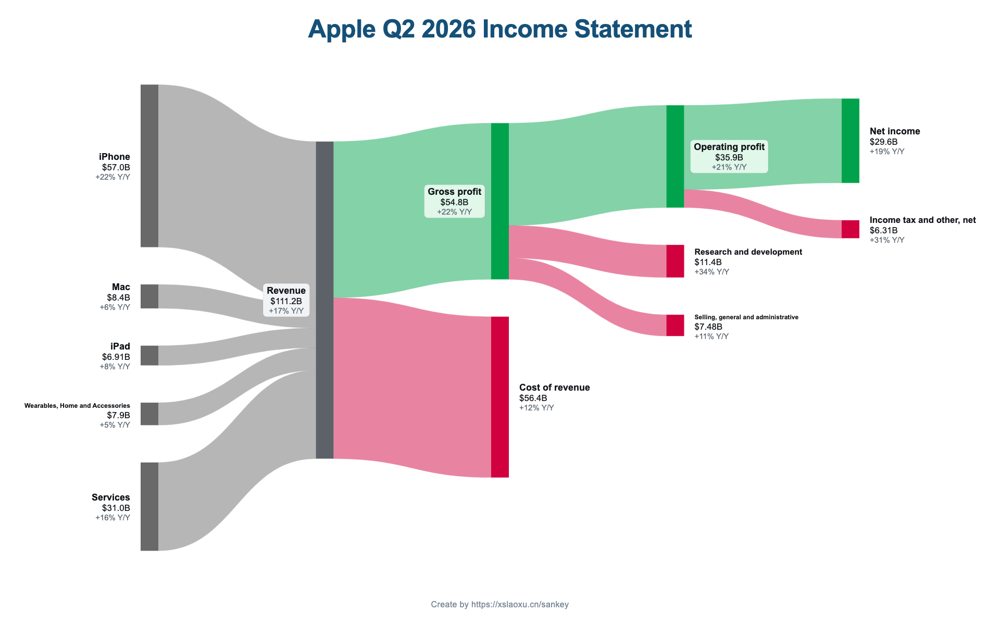
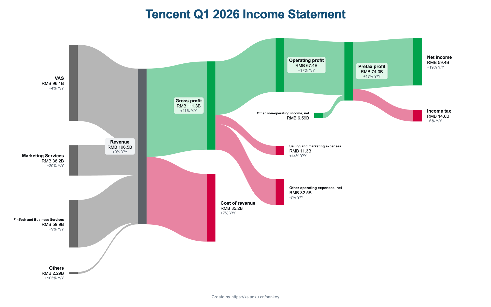
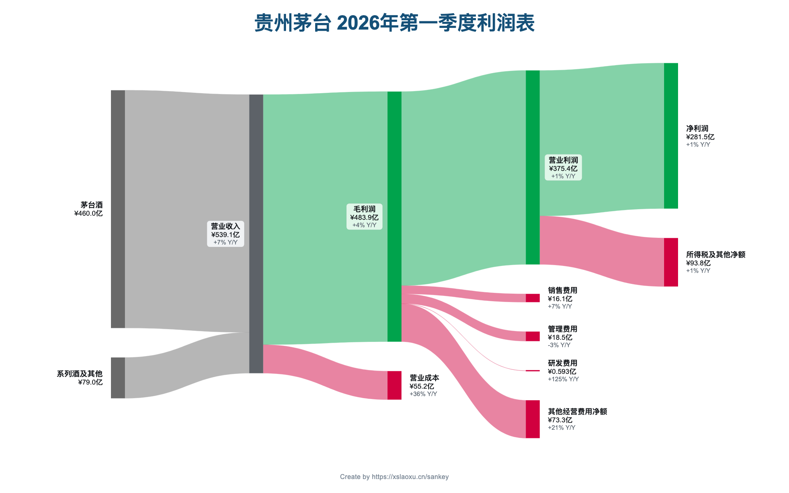

# Output examples

## Chinese request

> 把贵州茅台 2026 年一季报生成中文财务桑基图，金额用亿元，输出 PNG 和 SVG。

Expected delivery:

```text
output/
├── 贵州茅台-2026Q1.svg
└── 贵州茅台-2026Q1.png
```

Final client response shape:

```json
{
  "ok": true,
  "skill": "SankeyBuddy",
  "platform": "skillhub",
  "channel": "skillhub",
  "outputs": {
    "svg": "/absolute/path/output/贵州茅台-2026Q1.svg",
    "png": "/absolute/path/output/贵州茅台-2026Q1.png"
  },
  "png_renderer": "local",
  "stats": { "nodes": 16, "flows": 15 },
  "warnings": []
}
```

## English request

> Turn Apple's latest quarterly filing into an English revenue-to-net-income Sankey.
> Return SVG and PNG.

The response follows the same shape. The report determines the company and reporting
period; do not guess either value from the filename when the filing says otherwise.

## Website examples

### Apple



### Tencent



### 贵州茅台


